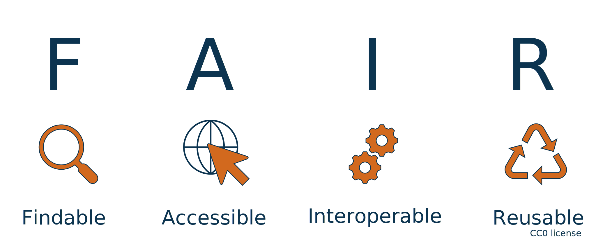

--- 
Lead: Bruna 
Duration: 45 min
Title: What is FAIR and why do I care?
To cover: 
- introduction round (10 min)
- What is FAIR (20 - 25 min)
- What is OPEN
- How FAIR and OPEN apply for training material
- Why make training materials Open and FAIR (10 min)
To Reuse:
- FAIR_&_OPEN_training -> https://docs.google.com/presentation/d/13aV9TIFyTQgDPRhaJAkXOrIfxxVJRZDxyr6UyXrSYAk/edit#slide=id.p 
- 10 simple rules 4 making training materials FAIR -> https://journals.plos.org/ploscompbiol/article?id=10.1371/journal.pcbi.1007854
- FAIR training handbook -> https://elixir-europe-training.github.io/ELIXIR-TrP-FAIR-training-handbook/
- No data, no paper (RDM training) -> https://docs.google.com/presentation/d/1GLwPc6E2HGNBBV5QPf_qYhyhXy_9Fggr/edit#slide=id.p1
---

!!! success "Learning Outcomes"

    By the end of this session, learners will be able to:  
    - Explain the 4 principles in the acronym FAIR
    - Differentiate FAIR and OPEN science and application in training material
    - Discuss the advantages of FAIR and OPEN training

# What is FAIR and why do I care ?

## 1.1 Presentation
Here you can find the presentation for this session: 
 
 <iframe src="https://docs.google.com/presentation/d/1FQp1Enrb-jLDfeZam19PITFPf4eii3rb/preview" width="640" height="360" allow="autoplay"></iframe>
 

The full presentation can be downloaded [here](https://docs.google.com/presentation/d/1FQp1Enrb-jLDfeZam19PITFPf4eii3rb/export?format=pdf).

## 1.2 What is FAIR

According to the [Cambrige dictionary](https://dictionary.cambridge.org/dictionary/english/fair) the word **fair** can mean _something that is expected or deserved_. However, in this context, FAIR refers to an acronym where each letter represents a key principle:  

<figure>
    
</figure>

  
Expecting training materials to be FAIR is only fair — don’t you agree?  
  
Before deciding whether that statement holds true, it helps to understand what each part of the acronym stands for. The concept of the **FAIR** principles emerged from the need to enable the reuse of scholarly data in research. These principles define a concise and measurable set of guidelines designed to promote reusability. They emphasize that data and materials should be accessible not only to humans but also in a machine-readable format.  
  
  
!!! danger "Challenge"

    Before looking at the answers below, try to answer with your current knowledge and perspective.
    
    "How would you interpret each of these principles?" 
    
    Elaborate shortly how you see each one (in general and for training) and then compare with the text below:
    
    1. Findable:
    2. Accessible:
    3. Interoperable:
    4. Reusable:

The main goal of the FAIR principles is to **SHARE**. In the context of training materials, this involves extending, updating and modifying the material to suit specific audiences or circumstances. To support this overarching goal, the four FAIR principles can be translated into ten practical rules for FAIR training, as described by [Garcia et al. 2020](https://journals.plos.org/ploscompbiol/article?id=10.1371/journal.pcbi.1007854).    
Findable:

For data, including training material, to be considered **FINDABLE** three key aspects should be taken into account: the material needs to be described in such a way that humans and machines can find the material and its metadata, it needs to have a unique identifier and it must be registered online in a catalogue or repository.

Accessible:

To be considered **ACCESSIBLE**, the most important aspect is to clearly define the access rules. This can be done through attaching a license, a document stating access rules or an access policy to the material. This information allows anyone who finds the material to understand how it can be accessed and what actions are permitted, such as sharing, reusing, or modifying it. In some cases, the material itself may be restricted or closed, but its metadata should remain discoverable, with the accessibility conditions clearly stated.

Interoperable:

The main idea behind materials being **INTEROPERABLE** is that they should work as expected across different operating systems (OS) and platforms. Achieving this can be more complex for training materials than for scientific data, as interoperability has been a focus in data analysis for a longer time. As will be discussed in the section on training materials, there are many types of training resources. Some may open easily on any OS, but may not be simple to edit, extend, or update. The question then becomes: "What is the perfect solution?" In practice, several technical options are available, some more suitable than others. However, the degree of interoperability will always depend on specific needs and contextual considerations, which will be explored later in this lesson.

Reusable:

After considering all the previous principles, the next step is to **REUSE** existing materials or ensure that new materials are reusable. In the context of training, there are two main groups who can benefit from reuse: (1) trainers and (2) trainees. Trainers should aim to annotate, describe, and present materials as clearly as possible so that others—whether trainers or trainees—can understand the content without requiring the author’s presence. It is also essential to keep your materials up to date, which can be facilitated by welcoming contributions, using collaborative platforms such as GitHub, and providing clear guidelines on how others can contribute.

When sharing or reusing materials, it is essential to provide proper attribution to those involved, whether as authors or contributors. Recognition ensures that the time and effort invested by individuals is acknowledged, unless a CC0 or similar license has been applied. This topic will be explored further in the following chapters.  
   
<figure>
    
</figure>

Ten simple rules for making training materials FAIR.

(Illustration from Luc Wiegers and Celia van Gelder:https://doi.org/10.5281/zenodo.3593257.)

## 1.3 How is FAIR different compared OPEN ?

Now that you know a bit about what the acronym FAIR stands for, consider the question: **how do FAIR and OPEN differ?**

OPEN refers to the rules governing access and sharing of materials. Clear rules determine whether material can be freely accessed, modified, and shared, or whether certain restrictions apply to specific groups. Access may be limited, for example, through platform registration, and authors can specify how and with whom materials may be shared. Last but not least, a resource can have restricted or closed access and still be considered FAIR: the metadata and information about the material remain discoverable, even if the content itself cannot be accessed. 

 <figure>
    
</figure>
  
**From the course:** [***RDM: your aly in your way to your publication***](https://github.com/vibbits/rdm-introductory-course/blob/main/presentations/2023jun14_Day01_Session01_General-perspective-RDM_intro_.pdf)

## 1.4 Why create FAIR training material?

Making training materials FAIR enables community exchange and allows the content to have a lasting impact. FAIR materials are easier to share, maintain, update, and reuse by others. Additionally, following FAIR practices helps ensure proper recognition for trainers and content creators. 

## 1.5 Links for extra reading

[Go-FAIR](https://www.go-fair.org/fair-principles/)
[10 simple rules 4 making training materials FAIR](https://journals.plos.org/ploscompbiol/article?id=10.1371/journal.pcbi.1007854)

 
