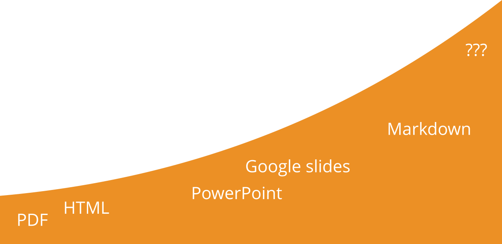

!!! success "Learning Outcomes"

    By the end of this session, learners will be able to:  
      
    - assess the degree of re-usability of training material  
    - explain the concepts of re-usability, interoperability and extendibility for training material  
    - develop presentation with narratives for each slides using Liascript  
    
    

## 4.1 Presentation

Here you can find the [presentation](https://liascript.github.io/course/?https://raw.githubusercontent.com/elixir-europe-training/ELIXIR-TrP-FAIR-Material-By-Design/refs/heads/main/docs/supplementary/presentations/ch_04_Type_of_training_material/chapter04-Types_of_training_material-presentation.md#1) for this session.

## 4.2 Formats for training material

In this chapter, we're going to explore the diverse landscape of training materials in life sciences. The goal is to identify different material types (slides, videos, datasets, software, etc.), consider which formats are commonly used, and reflect on the reasons behind those choices.  

For the first activity, we’ll examine different types of training materials, ranging from slides and videos to datasets and software. For each category, we’ll list possible formats, note which formats we typically use, and discuss why we prefer those formats. The aim is to deepen our understanding of format choices, surface different teaching practices, and perhaps discover new ways to engage learners.

Let’s get started! Please open the 'Answer' tab as a guide for this reflection exercise. 
As you work through it, focus on the why. That insight is key to improving how training is designed and delivered.

!!! question "Discussion"

    How many training material formats can you list? Identify possible formats for each type of material. Which format(s) do you mostly adopt? Why?
    
    ??? success "Answer as Table 1"
        | Material type | Possible format(s) | Format(s) you mostly use | Why? |
        | ----------------- | ------------------ | ------------------------ | ---- |
        | slides |                |                          |      |
        | video |                    |                          |      |
        | dataset  |                    |                          |      |
        | repository |  |    |      |
        | exercises  |                    |                          |      |
        | VM/Container |                    |                          |      |
        | tutorial/hands-on |      |                          |      |
        | software |                    |                          |      |
        | webpage |                    |                          |      |

### Compare your discussion results 

Our next activity focuses on assessing how our exploration of different training materials and formats aligns with the insights from the ['10 simple rules' paper](https://journals.plos.org/ploscompbiol/article/figure?id=10.1371/journal.pcbi.1007854.t001). Each format used to share knowledge in the life sciences comes with its own advantages and challenges. Let's consider how these formats support your objectives and how their strengths can be leveraged while minimizing potential limitations. 

!!! question "Reflection"
    Compare your list of the slide formats from above to the formats mentioned in the ['10 simple rules' paper](https://journals.plos.org/ploscompbiol/article/figure?id=10.1371/journal.pcbi.1007854.t001).

    ??? success "Answer as Table 1"
        | Format            | Advantages                                       | Disadvantages                                   |
        |-------------------|--------------------------------------------------|-------------------------------------------------|
        | **PPT and PPTX**      | Easily (re)usable                              | Limited way to provide detailed training  instructions    |
        |                   | Available to multiple OSs/Software             |                                     |
        |                   | Widespread                                     | Not version controlled                        |
        | **Keynote**           | Polished overall aesthetic                     | Limited to macOS family                       |
        |                   |                                                  | Not version controlled                        |
        | **PDF**               | Can be displayed identically in any environment| Not easily editable                           |
        |                   |                                                  | Not version controlled                        |
        | **TeX**               | Easily editable                                | Steep learning curve for trainers             |
        |                   | Version controlled                             |                                                 |
        | **MD,RST and HTML** | Version controlled                             | Rendering (need templating to transform into HTML) |
        |                   | Free                                           |                                            |
        | **Google slides**    | Version controlled                              | Not always possible to use owing to local/institutional policies     |
        |                   |    Free                                           |     Not always accessible (depending on geographic location                     |

### Summary of training material file formats

We're going to consolidate our understanding of the diverse resources we've been discussing. These resources form the backbone of our life science training and are crucial for a holistic learning experience. 

Let's take a brief tour through these resources[^1]: 

**Presentations:** Our journey begins with presentations, the visual storytellers of complex concepts. They provide clear, structured information at a glance. 

**Website:** A course website is your go-to destination of the knowledge, accessible anytime and anywhere, enriching your learning beyond the classroom. 

**Video:** Our videos offer dynamic and engaging narratives, making complex topics digestible and memorable. 

**Guidelines:** As checklists of our training, guidelines are your roadmap to best practices and essential procedures, ensuring you're always on the right track.

**Dataset:** Our datasets are the real-world data playgrounds where you can apply and hone your analytical skills. 

**Tutorial:** Our tutorials provide step-by-step guidance, helping you navigate through practical applications with ease. 

**Software:** The gear of our toolkit, software training is where you'll gain hands-on experience with the tools that drive life science research forward. 

Each of these resources is valuable training material that supports your teaching approaches in the life sciences. 

<!-- style="width: 700px;" -->

[^1]: https://docs.google.com/presentation/d/1fVbtwJACMnRM8GgMpGVfi373geFMQCZH6uSoihsRyxM/edit#slide=id.g26da19ef7b0_0_789

## 4.3 Training material crafted for collaboration

Training materials need to be captured in interoperable formats, so that they can be used in different contexts (e.g., operating systems and software tools) and built upon later. For materials like slides, it is important that other trainers are able to (re)use, fine-tune or even extend them. This means that you should choose a format that supports editing and extension. 

**Enhance your training materials via**

<!-- style="width: 650px;" -->

- Interoperability: Ensure your training materials are versatile. Use formats that are compatible across various operating systems and software platforms. 
- Reusability: Design your slides for longevity. Allow other trainers to adopt and adapt your materials with ease. 
- Editability & Extensibility: Select formats that support seamless editing and extension, enabling continuous improvement and customization.

### How re-usable public training material are

!!! question "Reflection"
    Have a look at the slides on the [String Database (by Lars Juhl Jensen)](https://www.slideshare.net/larsjuhljensen/the-string-database) on Slideshare. Imagine the slides were downloadable in pptx format.   |

    1. Could the presentation be extended?
    2. Could you choose a few slides and incorporate them in your presentation?
    3. Could you easily fix a typo?

### Evaluate interoperability and re-usability of training material

!!! question "Reflection"
    Consider the list of in table 1. For each format, specify whether it is interoperable, reusable or both and explain the reason for your opinion.
     
    | Formats | Interoperability | Reusability |
    | :---: | :---: | :---: |
    | pdf | partially | yes | 
    | | *A pdf can be read in any OS, but to modify it you need to pay a licence* | *Only as is* | 
    | ... | yes/no/partially | yes/no/partially | 
    | | *Explanation* | *Explanation* | 

### The more context you give about your material the better

1. For a lecture-style presentation, you can annotate each slide with an extensive narrative capturing all aspects of the subject on the slides. You can put the complete transcript of the verbal presentation in the Notes panel in Powerpoint or in Google slides. Suppose you want to share your slides in pdf format. In that case, it is handier to place the detailed content into a handbook or use text-book style reference materials and keep the slides for lectures cleaner, only placing relevant elements directly on the slides.

2. You may associate “Instructor notes” with the materials, but you don’t need to include them in the materials. The Instructor notes should provide information drawing on your experience or the experience of other instructors. They may consist of technical tips and tricks, common problems, and a description of what parts or exercises are essential and what could be skipped in case of lack of time. Very good examples of Instructor/Trainer notes are provided by the Carpentries ([Carpentry Trainer notes](https://carpentries.github.io/instructor-training/guide/index.html#curriculum), [Instructor notes template](https://carpentries.github.io/lesson-example/guide/index.html)).

3. You may create a lesson plan describing the purpose and the mode of delivery of each piece of material. Lesson plans could contain many practical details, including - for each part of the material - the time needed for the delivery, the learning experiences and expected learning outcomes.

|   |      |      |
| :---------: | :---------: | :---------: |
| |   | |
| narratives  | instructor notes     | lesson plan     |

## 4.3 Create and explore Interoperable and Reproducible training material (text, presentation)

In our session, we are using two different approaches - one using documents from the Google suite and another one using a markdown-based trainig material. Since many of use might have been using the Google suite already, let's first have a look at example presentations using Liascript, a markdown dialect.

**Example presentation**

[Rendering](https://liascript.github.io/course/?https://raw.githubusercontent.com/vibbits/material-liascript/master/example-presentation.md#1)

[File on Github](https://github.com/vibbits/material-liascript/blob/master/example-presentation.md?plain=1)

!!! note "Exercise"
    Create a presentation (2-4 slides) using a markdown dialect called Liascript in the repository you have created in session 3. It is another markdown file which will be linked in the rendered form in the course template. 
    Look at the [documentation about Liascript](https://liascript.github.io/course/?https://raw.githubusercontent.com/liaScript/docs/master/README.md#1) in case you need some extra inspiration.

!!! note "Exercise"
    Create a presentation using a Google slides. In the Google drive, create a presentation with 2-3 slides.

!!! note "Exercise"
    Create a PDF with Liascript (additional installation needed). By using the [Liascript exporter](https://github.com/LiaScript/LiaScript-Exporter), you can create a static PDF or ePub docuemnt as well as educational content for Learning management systems.

*************

## 4.5 Final considerations

When considering the re-usability and extendability of training materials, PDF documents offer limited flexibility due to their static nature, making them less adaptable for updates or interactive elements. HTML pages provide greater re-usability and extendability, allowing for dynamic content and easier updates. PowerPoint files are somewhat reusable but can be cumbersome to update and share collaboratively. Google Presentations enhance re-usability through cloud-based collaboration and real-time updates, though they still face limitations in format compatibility. Markdown-based material stands out for its high degree of re-usability and extendability, being easily editable, version-controlled, and convertible to various formats.

Looking ahead, the future of interoperable training material formats lies in developing standards that ensure seamless integration across platforms. Current gaps include inconsistent formatting, limited support for interactive elements, and challenges in maintaining version control across different tools. Addressing these gaps will be crucial for creating truly interoperable and user-friendly training materials.

<!-- style="width: 650px;" -->

