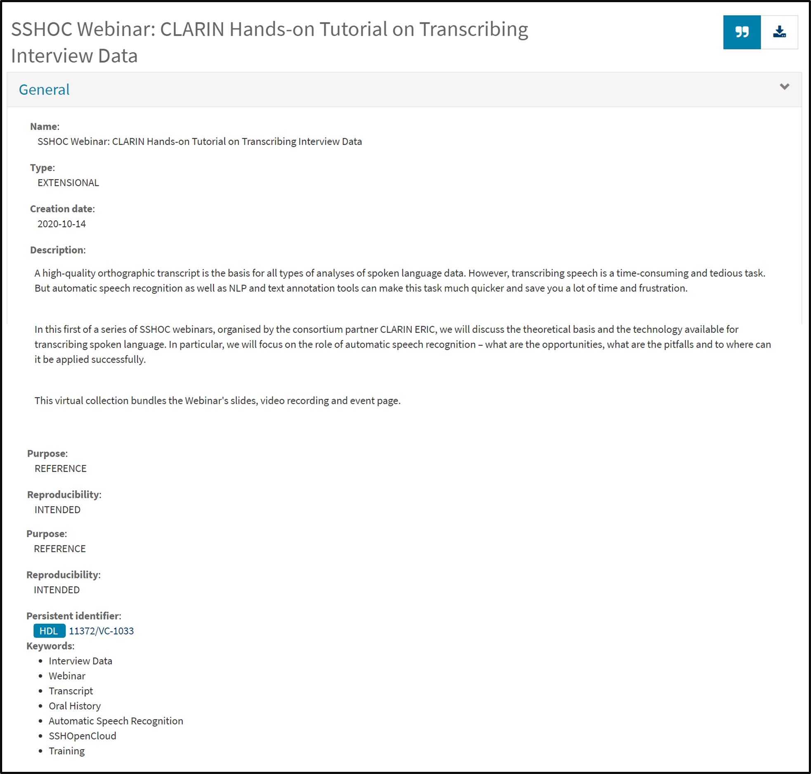
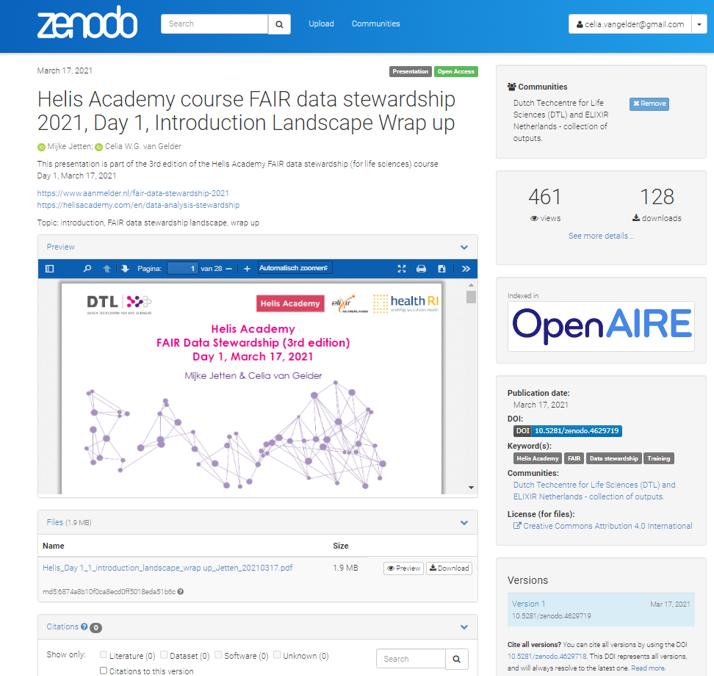

--- 
Lead: Elin 
Duration: 110 min
Title: Releases and use of unique identifiers
To cover: 
- What is a DOI and why is it useful for training materials 
- Different strategies for adding DOIs for training materials
- Connecting a GitHub repository with Zenodo to assign a DOI
- Use releases in GitHub to make new versions  
To Reuse:
- chapter 10 FAIR trianing handbook -> https://elixir-europe-training.github.io/ELIXIR-TrP-FAIR-training-handbook/chapters/chapter_10/
---

!!! success "Learning Outcomes"

    - Compare different strategies for unique identifiers for training material
    - Create versioned DOI for training material in a GitHub repository 

## 8.1 Unique identifiers for training materials (20 min)

### What is a unique persistent identifier (PID)?

A persistent identifier is a type of metadata that uniquely tags a digital object. 
 - leads to a landing page with the listed digital object and its metadata. Actual access to the digital object from this page might be restricted. 

### Why are PIDs useful for training materials?
Help distinguish between :
- different materials
- different versions of the same material
- different authors and contributors
- different oraginsations

"I attended this ELIXIR course on data management practices which was really good, you should have look at it" 

-- insert screenshot of a TeSS/Google search --

### Different type of unique identifiers useful for training materials:
- ORCIDs
- RORs
- DOIs

### DOIs for Training materials 
- 
- Versioning of DOIs

## 8.2 Selecting a strategy for unique identifiers (40 min)

### DOIs for presentations

!!! checklist "Case Studies of Using PIDs in Training"

    Read through the real world examples of using PIDs in Training from [chapter 5](https://elixir-europe-training.github.io/ELIXIR-TrP-FAIR-training-handbook/chapters/chapter_05/) in the the FAIR Training handbook. 

    - Summarise the strategy used in each use case
    - What is the main benefit with each strategy?
    - Are there any drawbacks with each strategy?

    ??? abstract  "Case 1 - Assigning a unique DOI combined with ORCID for each event in a community"

            
        At [Australian BioCommons](https://www.biocommons.org.au/), training materials from webinars and workshops are shared via a dedicated [Zenodo community](https://zenodo.org/communities/australianbiocommons-training/). BioCommons chose to use Zenodo to share training materials because they do not have a repository of their own, and Zenodo has established ways of managing metadata, DOIs and versioning. It is also widely used in the scientific community.

        For each event, a Zenodo record is created that includes detailed metadata, new training materials and links to previous materials that were reused as part of the training (Figure 1).

        Two types of PIDs are used when sharing materials from our events.

        * DOIs - Zenodo automatically assigns a DOI to the event. DOIs are also used when linking to related materials to ensure that there is no ambiguity about which materials were used.

        * ORCID - Trainers’ ORCIDs are used to ensure that they get the credit for their efforts and to make it clear who participated in the event.

        <figure>
            
        </figure>

        **Figure 1:** The Australian BioCommons collates materials from their events and shares them via Zenodo where they are assigned a DOI and authors are identified via their ORCIDs. [View this record on Zenodo.](https://zenodo.org/doi/10.5281/zenodo.5781811)

    
    ??? abstract "Case 2 - Creating virtual collections of training materials and assigning own PIDs"

        For [CLARIN](https://www.clarin.eu/), a training event usually consists of slides, handouts, a GitHub page, video tutorials, language resources, datasets and/or tools. The slides and handouts are published on the event web page, while the video recordings of the presentations are published on the CLARIN YouTube channel. In addition, the language resources and tools used during the training are stored in the CLARIN national repositories, with a **unique** identifier assigned by the institution and can be cited.

        One solution to have a PID assigned to all the materials used during one training event is to create a virtual collection in the CLARIN [Virtual Collection Registry](https://collections.clarin.eu/public?7). A virtual collection is a coherent set of links of digital objects that can be easily created, accessed and cited with the help of **unique identifiers**, for example, a DOI. The links can originate from different archives. [Here](http://hdl.handle.net/11372/VC-1033) is an example of a virtual collection created for a hands-on tutorial on transcribing interview data

        <figure>
            
        </figure>
        **Figure 2:** Example of a training collection in the CLARIN Virtual Collection Registry that has been assigned a persistent identifier.

        <figure>
            
        </figure>

        **Figure 3:** Example of a BibTeX citation in the CLARIN Virtual Collection Registry.

        Other practices that the trainers in the CLARIN community have adopted are:

        - First, depositing the training materials together with the datasets in their CLARIN national data repository. See example:[Archilochus of Paros: Elegiac Fragments - XML Archive](http://hdl.handle.net/20.500.11752/OPEN-537). The advantage of using this path is that the authors can add more extensive metadata to describe their materials. 
        - Second, depositing the training materials on Zenodo. See example: [Introduction to Speech Analysis](https://doi.org/10.5281/zenodo.5506969).  In this case, **related identifiers** are included that lead users to the main platform where the course is stored and maintained. 
        - Third, adding the metadata of the training materials to the SSHOC Open Marketplace, see example: [Jupyter notebooks for Europeana newspaper text resource processing with CLARIN NLP tools](https://marketplace.sshopencloud.eu/training-material/duVII1). In this case, the Marketplace does not assign any unique identifiers, but the authors can identify themselves via their ORCID and can suggest a citation format for their collection.

    ??? abstract "Case 3 - Creating virtual collections of training materials and assigning own PIDs"

        The [Dutch Techcentre for Life Sciences](https://www.dtls.nl/) (DTL) has a [Zenodo community](https://zenodo.org/communities/dtl/?page=1&size=20) to upload presentations and course materials. DTL has chosen to give separate DOIs for individual, often topical, elements of a course. An example is the [Helis Academy FAIR Datastewardship Course](https://www.aanmelder.nl/fair-data-stewardship-2021), a course of 6 half days. 

        Providing a separate DOI has the following advantages: It is easier to mix and match different modules as part of a learning path, i.e. different combinations of our training modules can be made for the various target audiences, tailored to that specific purpose. When updating or revising a single module, it is more convenient to have that module as a separate entity with its own DOI, in order to easily keep track of the versions of different modules.

        At the level of the full course, we have chosen to use ELIXIR TeSS as the registry. Links to our training event details and training materials can be found [here](https://tess.elixir-europe.org/events/helis-course-fair-data-stewardship).

        <figure>
            
        </figure>
        **Figure 4:** Example from the DTL Helis FAIR Data Stewardship Course with separate DOIs per topic. See more [here](https://www.aanmelder.nl/fair-data-stewardship-2021).

        <figure>
            

### DOIs for GitHub repositories and making use of releases to version training material

Releases are deployable software iterations you can package and make available for a wider audience to download and use. 

- tags
- release notes
    - release note templates
- version semantics
- who can do what?
- How is metadata transferred from GitHub to Zenodo?

!!! question "Reflection"

    Think about what would be a good strategy to use for your own context 
    
    ??? Tip "Things to consider"

        - Do you want to get a PID for each training material?
        - Do you want to get one PID for your whole training or course?
        - Do you want to get a separate PID for each topic/module? For example, for a course containing several topics.
        - Do you want to create a collection of topics with a PID where each concept will also have a PID and associated metadata?
        - Do you want to get one PID for your whole training or course?

        Read more in [Chapter 5 of the FAIR Training Handbook](https://elixir-europe-training.github.io/ELIXIR-TrP-FAIR-training-handbook/chapters/chapter_05/#how-to-get-a-doi-for-your-training-materials)

## 8.3 Tutorial for implementing your strategy (50 min)

Now we will use Zenodo sandbox to create DOIs for our training material project from this course. A sandbox is used for testing purposes and DOIs created in the Zenodo Sandbox are not real and will not resolve.

This turtorial will guide you through the steps of creating a Zenodo record for your GitHub repository which will be automatically versioned. Upon creation of a new realse of your repository, a new DOI, linked to the original one,  will be issued. Make sure to have an ORCID and a GitHub account before we get started.

??? success "Get an ORCID iD"

    Create your ORCID iD by [registering](https://orcid.org/register) at the [ORCID website](https://info.orcid.org/researchers/)

??? success "Get a GitHub account"

    Create your GitHub account by [signing up](https:/github.com)

### Step 1 - Link your repository to Zenodo
1. Go to [Zenodo Sandbox](https://sandbox.zenodo.org/)
2. Sign up or sign in with your GitHub account
3. Click the down arrow next to your `username` in the top right corner to expand the menu,  select `GitHub`
> If you have not used your GitHub account to sign in to Zenodo sandbox select `Linked Accounts` first to connect your accounts
4. Find your repository in the list, toggle the switch to `ON`
> If your repository does not show up in the list, check when it was last synced in the title row of the first box and  click `sync now`if needed
5. Reload the page > your repository should now be added to the list of `Enabled Repositories`
6. Click on the repository to reach the Zenodo page of that repository > click `Create release` in the title row of the `Releases box`
You have now moved to GitHub where we will create a release that will trigger an Zenodo record to be created.

### Step 2 - Create a GitHub release of your repository

1. Create a tag by clickincg the `Choose a tag` button in the top left part of the page. Enter `v0.0.1` in the text field and click `+ Create new tag: on publish`
2. Just below, enter `initial release` as the Release title
3. In the large text box, add `This is the initial release of <Title of your training material>` as release notes 
4. Click the green button `Publish release`
A DOI record has now been created for your repository. Return to your [Zenodo Sandbox](https://sandbox.zenodo.org/) > GitHub settings (see above) and inspect the list of `Enabled Repositories`. A black and blue DOI badge should now be available next to your repository name.  
5. To add the DOI badge to repository click the badge, in the popup window, copy the Markdown formatted text. 
6. Go to your GitHub repository and select your `readme.md` file in the left side menu. Click the pen in the top right > paste the copied markdown text at the top of the file and commit your changes by clicking the green button in the top right corner
Now it's time to inspect the record and the metadata it contains. Return to your [Zenodo Sandbox](https://sandbox.zenodo.org/) and click `Dashboard`in the middle of the top menu. Click on your record in the list and inspect the information in the record.

!!! question "Reflection"

    Can you find some metadata which is automatically imported from the github repository? What metadata is missing?
    
    ??? tip "Hints"

        Zenodo automatically extract metadata about your release from GitHub APIs. For example, the authors are determined from the repository’s contributor statistics or the citation.cff file that is used to populate the GitHub repository with information. To overwrite some of the default metadata that would come from a regular GitHub release you can include a .zenodo.json file at the root of your GitHub repository. This will not be covered in this course but you can find more information in the [Zenodo Developers documentation](https://developers.zenodo.org/#add-metadata-to-your-github-repository-release)

        | Zenodo Record      | GitHub Repository                    |
        | -------------------| ------------------------------------ |
        | Description        | release notes |
        | Title              | name of repository or citation.cff file if in place|
        | Creators           | citation.cff file if in place|

7. Now, create a new release of your repository. This time, include the description of your Training material as release notes. 

### Step 3 - Add additionl metadata to your record

Rich metadata is very important for making any kind of digital object FAIR. We will manually add the metadata from the previous session in the Zenodo Record fot your repository.  

1. In your Zenodo Sandbox Dashboard, click `edit` next to your repository in the list
2. Set (change or add) the following:

    - `Resource type` to "Lesson"
    - `License` to "Creative Commons Attribution 4.0 International aka CC-BY-4.0"
    - `Keywords` as specified previously
    - `Funding` if any

3. In the `Creators`section, click `edit` next to an existing name or click the `Add creator` button below the names. Make sure to add the Names, the ORCID-iD in the `Identifiers` field and one or several Affiliations.
4. In the `Related Works`field click `Add related work` to add a link to your TeSS record as follows:

    - `Relation`:  "Is described by" 
    - `Identifier`: "the url to your record"
    - `Scheme`: "URL"
    - `Resource type`: "Event"

5. Click `Save draft` in the right side-menu and then `Preview`. Review your record and if everything looks good, click `Back to edit` in the top left and then `Publish`in the right side-menu.

### Step 4 - Link your training material to your TeSS record through the DOI

The F3 principle of the [FAIR data pronciples](https://www.go-fair.org/fair-principles/) states that "Metadata clearly and explicitly include the identifier of the data they describe" and this applies to training materials as well. The association between the description of your course in TeSS and the course material in the GitHub repository should be done by mentioning the DOI is the TeSS record (and the repository) and also linking to the TeSS record from Zenodo.

1. Go TeSS sandbox
2. Click edit
3. Add the DOI in the apporpriate place

??? abstract "Additional exercises"

    1. Add a citation.cff file to your repository
    2. Add a .zenodo.json file to your repository. For an example see https://cdnis-brain.readthedocs.io/zenodo/

