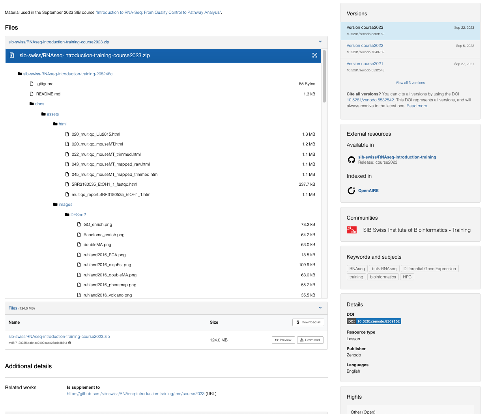

--- 
Lead: Ineke 
Duration: 105 min (8.2 - 20 min, 8.3 - 40 min, 8.4 - 50 min)  
Title: Releases and use of unique identifiers
To cover: 
- What is a PID and why is it useful for training materials 
- Different strategies for adding DOIs for training materials
- Connecting a GitHub repository with Zenodo to assign a DOI
- Use releases in GitHub to make new versions 
To Reuse:
- chapter 10 FAIR trianing handbook -> https://elixir-europe-training.github.io/ELIXIR-TrP-FAIR-training-handbook/chapters/chapter_10/
---

!!! success "Learning Outcomes"

    By the end of this session, learners will be able to:  
    
    - Explain what unique persistent identifiers are and their benefits
    - List and differentiate the types of unique identifiers that are relevant for publishing and sharing training materials
    - Compare different strategies for unique identifiers for training materials
    - Create versioned DOIs for training materials

## 8.1 Presentation
Here you can find the presentation for this session:

<iframe src="https://docs.google.com/presentation/d/1B17jD_C7knHazgsbyv8EmXPf-3RXTEJZ/preview" width="640" height="360" allow="autoplay"></iframe>  
  
The full presentation can be downloaded as a pdf [here](https://docs.google.com/presentation/d/1B17jD_C7knHazgsbyv8EmXPf-3RXTEJZ/export?format=pdf).  
  

## 8.2 Unique identifiers for training materials  

### What is a unique persistent identifier (PID)?

A persistent identifier (PID) is a long-lasting reference that uniquely tags a resource. PIDs are often used in the context of digital objects and are actionable, meaning that you can resolve them in a web browser and be taken to a webpage containing the digital object and its associated metadata. Actual access to the digital object on this page might be restricted, as a PID may be connected to a set of metadata describing an item rather than to the item itself.  
The primary purpose of a PID is to provide the information required to reliably **identify, verify, and locate** the resource it is associated with. To achieve this, PIDs must comply with a few key principles:  

* **Globally unique:**

    To ensure global uniqueness, a PID should follow a **controlled syntax** to avoid conflicts. This can be achieved for example by using namespaces that are governed by clearly defined authorities. 

* **Persistent:** 

    The identifier, and the object it points to, should be **maintained over the long term**. The syntax used for the identifier should also remain persistent. 

* **Resolvable**: 

    The identifier should allow both **human and machine users** to access the resource or its related information.

One of the most common PIDs used by public repositories is the  **Digital Object Identifier (DOI)** ([doi.org](https://www.doi.org/)). DOIs are coupled with metadata that can be modified over time and to keep track of the locations and characteristics of the objects they identify. DOIs are generated automatically when you make your resources available in a repository such as Dataverse or Zenodo, or when a research article is published.   
>  DOI relies on a non-profit organisation that is the governance body of the federation of registration agencies. If you would like to learn more about the concept of DOIs, take a look at this [fact sheet](https://www.doi.org/factsheets/DOIKeyFacts.html).
  
### Why are PIDs useful for training materials?  
  
Using a public repository to assign a DOI to your training materials brings several benefits that align closely with the **FAIR principles**:

**Findable (F):**  
DOIs make your resources **uniquely identifiable**, preventing confusion between similar materials. They also provide a structured place to store and manage **metadata**, which can be read by both humans and machines. Because DOIs are **machine-actionable**, they improve **searchability and discoverability**, helping others easily find your materials through search engines or automated systems.

**Accessible (A):**  
Each DOI **resolves** to a **landing page** that contains information about the resource and how to access it. Even if the location of the actual file changes, the DOI will always direct users to the current metadata or resource, ensuring that access remains consistent over time.

**Interoperable (I):**  
While a DOI itself does not automatically make a resource interoperable, the **standardized metadata schemas** (such as those provided by **DataCite**) help ensure that data and information can be shared and understood across different systems and repositories.

**Reusable (R):**  
DOIs enhance **citability** and **attribution**, allowing others to reference your work accurately. Persistent identifiers support **long-term tracking** and recognition of your outputs, promoting reuse and helping your materials remain valuable and usable well into the future.

### Other persistent identifiers useful for training materials

There are several types of PIDs designed for different kinds of resources or objects.  
For training materials, the following PIDs are the most important:

* **ORCID**  
[ORCID](https://orcid.org/) (Open Researcher and Contributor ID) provides a unique and persistent identifier for individual researchers, free of charge.  
It helps distinguish between people with similar names (homonyms) and ensures that your work is correctly attributed to you, regardless of name changes or institutional moves. ORCID allows you to add aliases if your name changes, and your ORCID iD remains the same even when you change affiliations. This makes it a powerful tool for maintaining your research identity over time, ensuring that you always get proper credit and that your scholarly contributions are easy to track globally.

* **ROR**   
The [Research Organization Registry (ROR)](https://ror.org/) is a global, community-led registry that assigns open persistent identifiers to research organizations. ROR helps systems and users unambiguously identify institutions and connect them to researchers and research outputs. For example, *Science for Life Laboratory* is often referred to as *SciLifeLab*. To avoid confusion between names, the [SciLifeLab ROR ID](https://ror.org/04ev03g22) uniquely identifies the organization, ensuring consistent and accurate affiliation metadata across platforms and publications.

Together, **ORCID**, **ROR**, and **DOI** form the foundation for making your training materials, their creators and institutions **clearly identifiable, citable, and FAIR**.  

!!! question "Reflection"

    In the context of training materials why are PIDs needed?
    Which identifier should be used for each need?

    ??? success "Answer"
           PIDs can help distinguish between:

        - different materials  -  **DOI**
        - different versions of the same material -  **DOI**
        - different authors and contributors -  **ORCID**
        - different oraginsations -  **ROR**

!!! note "Exercise"

    Go to the [ROR search page](https://ror.org/search) and try to find your organisation's ROR

## 8.3 Selecting a strategy for unique identifiers

### DOI strategies for courses

!!! checklist "Case Studies of Using PIDs in Training"

    Read through the real world examples of using PIDs in Training from [FAIR handbook (chapter 05)](https://elixir-europe-training.github.io/ELIXIR-TrP-FAIR-training-handbook/chapters/chapter_05/) (by [ELIXIR training platform](https://elixir-europe-training.github.io/ELIXIR-TrP-FAIR-training-handbook/contributor_list/), [CCBYSA 4.0 license](https://github.com/elixir-europe-training/ELIXIR-TrP-FAIR-training-handbook/blob/main/LICENSE.md)), and answer the following questions in the [shared document](https://docs.google.com/document/d/14zbkvn0VzKrNvAUhmUOgAe2rWzVbLRrWMEcfawqhmKU/edit?usp=sharing):

    - Summarise the strategy used in each use case
    - What is the main benefit with each strategy?
    - Are there any drawbacks with each strategy?

    ??? abstract  "Case 1 - Assigning a unique DOI combined with ORCID for each event in a community"

            
        At [Australian BioCommons](https://www.biocommons.org.au/), training materials from webinars and workshops are shared via a dedicated [Zenodo community](https://zenodo.org/communities/australianbiocommons-training/). BioCommons chose to use Zenodo to share training materials because they do not have a repository of their own, and Zenodo has established ways of managing metadata, DOIs and versioning. It is also widely used in the scientific community.

        For each event, a Zenodo record is created that includes detailed metadata, new training materials and links to previous materials that were reused as part of the training (Figure 1).

        Two types of PIDs are used when sharing materials from events:

        * DOIs - Zenodo automatically assigns a DOI to the event. DOIs are also used when linking to related materials to ensure that there is no ambiguity about which materials were used.

        * ORCID - Trainers’ ORCIDs are used to ensure that they get the credit for their efforts and to make it clear who participated in the event.

        <figure>
            
        </figure>

        **Figure 1:** The Australian BioCommons collates materials from their events and shares them via Zenodo where they are assigned a DOI and authors are identified via their ORCIDs. [View this record on Zenodo.](https://zenodo.org/doi/10.5281/zenodo.5781811)

    
    ??? abstract "Case 2 - Creating virtual collections of training materials and assigning own PIDs"

        For [CLARIN](https://www.clarin.eu/), a training event typically includes slides, handouts, a GitHub page, video tutorials, language resources, datasets, and/or tools. The slides and handouts are published on the event web page, while video recordings of the presentations are made available on the CLARIN YouTube channel. In addition, the language resources and tools used during the training are stored in CLARIN’s national repositories, where they are assigned unique identifiers by the hosting institutions, ensuring that they can be cited and reliably referenced.

        One solution to have a PID assigned to all the materials used during one training event is to create a virtual collection in the CLARIN [Virtual Collection Registry](https://collections.clarin.eu/public?7). A virtual collection is a coherent set of links of digital objects that can be easily created, accessed and cited with the help of PIDs, e.g. a DOI. The links can originate from different archives. [Here](http://hdl.handle.net/11372/VC-1033) is an example of a virtual collection created for a hands-on tutorial on transcribing interview data.

        <figure>
            
        </figure>
        **Figure 2:** Example of a training collection in the CLARIN Virtual Collection Registry that has been assigned a persistent identifier.

        <figure>
            
        </figure>

        **Figure 3:** Example of a BibTeX citation in the CLARIN Virtual Collection Registry.

        Other practices that the trainers in the CLARIN community have adopted are:

        - Depositing the training materials together with the datasets in their CLARIN national data repository. See example: [Archilochus of Paros: Elegiac Fragments - XML Archive](http://hdl.handle.net/20.500.11752/OPEN-537). The advantage of using this path is that the authors can add more extensive metadata to describe their materials. 
        - Depositing the training materials on Zenodo. See example: [Introduction to Speech Analysis](https://doi.org/10.5281/zenodo.5506969). In this case, related identifiers are included that lead users to the main platform where the course is stored and maintained. 
        - Adding the metadata of the training materials to the [SSHOC Open Marketplace](https://sshopencloud.eu), see example: [Jupyter notebooks for Europeana newspaper text resource processing with CLARIN NLP tools](https://marketplace.sshopencloud.eu/training-material/duVII1). In this case, the Marketplace does not assign any unique identifiers, but the authors can identify themselves via their ORCID and can suggest a citation format for their collection.

    ??? abstract "Case 3 - Separate DOIs for mixing and matching in a community"

        The [Dutch Techcentre for Life Sciences](https://www.dtls.nl/) (DTL) has a [Zenodo community](https://zenodo.org/communities/dtl/?page=1&size=20) to upload presentations and course materials. DTL has chosen to give separate DOIs for individual, often topical, elements of a course. An example is the [Helis Academy FAIR Datastewardship Course](https://www.aanmelder.nl/fair-data-stewardship-2021), a course of 6 half days. 

        Providing a separate DOI has the following advantages: 
        
        -  It is easier to mix and match different modules as part of a learning path, i.e. different combinations of training modules can be made for the various target audiences, tailored to that specific purpose.  
        - When updating or revising a single module, it is more convenient to have that module as a separate entity with its own DOI, in order to easily keep track of the versions of different modules.  

        At the level of the full course, DTL uses [ELIXIR TeSS](https://tess.elixir-europe.org) as the registry. Links to training event details and training materials can be found [here](https://tess.elixir-europe.org/events/helis-course-fair-data-stewardship).

        <figure>
            
        </figure>
        **Figure 4:** Example from the DTL Helis FAIR Data Stewardship Course with separate DOIs per topic. See more [here](https://www.aanmelder.nl/fair-data-stewardship-2021).

        <figure>
            
         </figure>
         **Figure 5:** Zenodo record for the Introductory Module of the DTL FAIR Data Stewardship Course. View [this record](https://doi.org/10.5281/zenodo.4629718) on Zenodo.

### DOIs strategies for GitHub repositories and making use of releases to version training material

In this course we have promoted the use of GitHub for hosting markdown based training material. The public repositories Zenodo and Figshare integrate directly with GitHub to automatically issue DOIs for repositories. These integrations rely on GitHub `releases`, which are essentially snapshots of your project taken at a specific point in time. A release packages your project in a stable, downloadable form, making it easier for others to access and use. Each release is linked to a version number (for example, v1.0) and is created from a specific `tag` in your GitHub repository. Tags mark particular commits in the project’s history, allowing you and others to track the evolution of your work and see what has changed between versions.

In addition to tagging a release, you can add a `title` and `release notes` to include basic metadata that describes what has changed in that version. If you use **Zenodo** to archive your GitHub repository, the release notes are automatically imported as the record’s `description`, while some metadata fields are populated by default, e.g. `Resource type` is set to "Software" and a link to the GitHub repository is included under `related works` (or can be added manually if needed). 

Each time you create a new release, a new version of your **Zenodo** or **Figshare** record is generated, and a **new DOI** is issued.  
This DOI and the DOIs representing previous versions are automatically linked together, and an additional DOI is created to represent **all versions** of the record collectively. Read more about DOI versioning in Zenodo [here](https://sandbox.zenodo.org/help/versioning).  
         
<figure>

</figure>

**Figure 6:** Example of Zenodo record for GitHub repository containing the training material for the SIB course Introduction to RNAseq... See more [here](https://zenodo.org/records/8369162).

!!! question "Reflection"

    What could a good DOI strategy look like for your own context? 
    
    ??? Tip "Things to consider"

        - Do you want to assign a DOI to each individual training material, such as a video, slide deck, or document?
        - Would it be more useful to have one PID for the entire course or training package?
        - If your course is divided into multiple topics or modules, would you prefer to assign a separate PID to each of them?
        - Or would you rather create a collection PID that represents the whole course, while still assigning individual PIDs (and metadata) to each topic or component within it?  

        Read more in [Chapter 5 of the FAIR Training Handbook](https://elixir-europe-training.github.io/ELIXIR-TrP-FAIR-training-handbook/chapters/chapter_05/#how-to-get-a-doi-for-your-training-materials)
    

## 8.4 Tutorial for implementing your strategy

Now we will use Zenodo sandbox to create DOIs for our training material project from this course. A sandbox is used for testing purposes and DOIs created in the Zenodo Sandbox are not real and will not resolve. Choose the appropriate tutorial below based on the hosting platform you've used in the previous sessions.

 

??? note "Get a DOI for a GitHub repository"

    This tutorial will guide you through creating a Zenodo record for your GitHub repository that supports automatic versioning. Each time you create a new release of your repository, Zenodo will generate a new DOI that is linked to the original one. Before we get started, make sure you have the following accounts set up:  

    ??? success "Get an ORCID"

        Register for an ORCID iD at the [ORCID website](https://info.orcid.org/researchers/)

    ??? success "Get a GitHub account"

        If you don’t already have one, create a GitHub account by signing up [here](https:/github.com)

    #### Step 1- Link your repository to Zenodo
    1. Go to [Zenodo Sandbox](https://sandbox.zenodo.org/)
    2. Sign up or sign in with your GitHub account
    3. Click the down arrow next to your `username` in the top right corner to expand the menu,  select `GitHub`
    > If you have not used your GitHub account to sign in to Zenodo sandbox select `Linked Accounts` first to connect your accounts
    4. Find your repository in the list, toggle the switch to `ON`
    > If your repository does not show up in the list, check when it was last synced in the title row of the first box and  click `sync now`if needed
    5. Reload the page > your repository should now be added to the list of `Enabled Repositories`
    6. Click on the repository to reach the Zenodo page of that repository > click `Create release` in the title row of the `Releases box`
    You have now moved to GitHub where we will create a release that will trigger an Zenodo record to be created.

    #### Step 2 - Create a GitHub release of your repository

    1. Create a tag by clicking the `Select tag` button in the top left part of the page. Enter `v0.0.1` in the text field and click `Create new tag`
    2. Just below, enter `initial release` as the Release title
    3. In the large text box, add `This is the initial release of <Title of your training material>` as release notes 
    4. Click the green button `Publish release`
    A DOI record has now been created for your repository. Return to your [Zenodo Sandbox](https://sandbox.zenodo.org/) > GitHub settings (see above) and inspect the list of `Enabled Repositories`. A black and blue DOI badge should now be available next to your repository name.  
    5. To add the DOI badge to repository click the badge, in the popup window, copy the Markdown formatted text. 
    6. Go to your GitHub repository and select your `readme.md` file in the left side menu. Click the pen in the top right > paste the copied markdown text at the top of the file and commit your changes by clicking the green button in the top right corner
    Now it's time to inspect the record and the metadata it contains. Return to your [Zenodo Sandbox](https://sandbox.zenodo.org/) and click `Dashboard`in the middle of the top menu. Click on your record in the list and inspect the information in the record.

    !!! question "Reflection"

        Which metadata is automatically imported from your GitHub repository? Are there any important metadata fields that are missing?  
        
        ??? tip "Hints"

            Zenodo automatically extracts metadata about your release from GitHub APIs. For example, the authors are determined from the repository’s contributor statistics or the citation.cff file that is used to populate the GitHub repository with information. To overwrite some of the default metadata that would come from a regular GitHub release you can include a .zenodo.json file at the root of your GitHub repository. This will not be covered in this course but you can find more information in the [Zenodo Developers documentation](https://developers.zenodo.org/#add-metadata-to-your-github-repository-release)

            | Zenodo Record      | GitHub Repository                    |
            | -------------------| ------------------------------------ |
            | Description        | release notes |
            | Title              | name of repository or citation.cff file if in place|
            | Creators           | citation.cff file if in place|

    7. Now, create a new release of your repository. This time, include the description of your Training material as release notes. 

    #### Step 3 - Add additional metadata to your record

    Rich metadata is essential for making any digital object FAIR. In this step, we will manually add the metadata from the previous session to your Zenodo record for the repository.    

    1. In your Zenodo Sandbox Dashboard, click `edit` next to your repository in the list
    2. Set (change or add) the following:

        - `Resource type` to "Lesson"
        - `License` to "Creative Commons Attribution 4.0 International aka CC-BY-4.0"
        - `Keywords` as specified previously
        - `Funding` if any

    3. In the `Creators`section, click `edit` next to an existing name or click the `Add creator` button below the names. Make sure to add 'Name', 'ORCID' (under 'identifiers'), and one or several 'affiliations'.
    4. In the `Related Works`field click `Add related work` to add a link to your TeSS record as follows:

        - `Relation`:  "Is described by" 
        - `Identifier`: "the url to your record"
        - `Scheme`: "URL"
        - `Resource type`: "Event"

    5. Click `Save draft` in the right side-menu and then `Preview`. Review your record and if everything looks good, click `Back to edit` in the top left and then `Publish`in the right side-menu.

    #### Step 4 - Link your training material to your TeSS record through the DOI

    The F3 principle of the [FAIR data principles](https://www.go-fair.org/fair-principles/) states that *Metadata clearly and explicitly include the identifier of the data they describe*. This principle also applies to training materials. To link your course description in TeSS with your course materials in a GitHub repository, include the DOI generated by Zenodo in the TeSS record (and in the repository) and link back to the TeSS record from Zenodo.  

    1. Go to the [test instance of TeSS](https://dev.tess.elixir-europe.org/users/sign_up)
    2. Click `Edit` on your course record
    3. Add the DOI in the designated field

    ??? abstract "Additional exercises"

        1. Add a citation.cff file to your repository
        2. Add a .zenodo.json file to your repository. For an example see [https://cdnis-brain.readthedocs.io/zenodo/](https://cdnis-brain.readthedocs.io/zenodo/)

??? note "Get a DOI for material in a Google Drive folder"

    This tutorial will guide you through creating a Zenodo record for your training materials hosted on Google Drive. Please ensure you have an ORCID before starting.

    ??? success "Get an ORCID"

        Register for an ORCID iD at the [ORCID website](https://info.orcid.org/researchers/)  
   

    #### Step 1 - Reserve a DOI on Zenodo
    1. Go to [Zenodo Sandbox](https://sandbox.zenodo.org/)
    2. Sign up or sign in with your email adress or Github account 
    > The ORCID connection might not be stable for Zenodo Sandbox
    3. Click the plus sign next to your `username` in the top right corner to expand the menu
    4. Select `New upload`
    5. Under `Basic information` go through the mandatory fields one by one and set as follows:
        - `Do you already have a DOI for this upload` to "No"
        - `Resource type` to "Lesson"
        - `Title` to "Title of your Training material"
        - `Publication date` to "today's date"
        - `Creators` click `+ Add Creator` button and add your group members ORCIDs one at the time
        - `Description` add the course description formatted in a human readable way
        - `License` to "Creative Commons Attribution 4.0 International aka CC-BY-4.0"
    6. Go back to the first field `Digital Object Identifier`, click the button `Get a DOI now!` > This will reserve a DOI for your record that can be included in your files prior to upload. Copy the reserved DOI that has appeared to the left. It should look similar to this: `10.5072/zenodo.109776`
    7. Click `Save draft`in the right hand menu
    
    #### Step 2 - Upload  your files
    1. Go to your Google Drive folder
    2. In your `readme file`, add the DOI you reserved in the previous step 
    3. Now download the entire folder by right clicking on the folder name and then select `download`. A `.zip file` will de downloaded to your computer. 
    4. Locate the `.zip file` on your computer
    5. Return to [Zenodo Sandbox](https://sandbox.zenodo.org/) and in your Dashboard, click `edit` next to your saved record in the list
    6. Upload the `.zip file` you downloaded from your Google Drive folder by `Drag and drop` or by clicking the `Upload files` button
    7. Click `Save draft` in the right side-menu and then `Preview`. Review your record and if everything looks good, click `Back to edit` in the top left and then `Publish`in the right side-menu.

    #### Step 3 - Add additional metadata to your record

    Rich metadata is essential for making any digital object FAIR. In this step, we will manually add the metadata from the previous session to your Zenodo record for the repository. Adding or updating metadata does not create a new version of the record. A new version, and a new DOI, is only generated if you upload additional files to the repository.  

    1. In your Zenodo Sandbox Dashboard, click `edit` next to your repository in the list
    2. Set (change or add) the following:

        - `Keywords` as specified previously
        - `Funding` if any

    3. In the `Related Works`field click `Add related work` to add a link to your TeSS record as follows:

        - `Relation`:  "Is described by" 
        - `Identifier`: "the url to your record"
        - `Scheme`: "URL"
        - `Resource type`: "Event"

    4. Click `Save draft` in the right side-menu and then `Preview`. Review your record and if everything looks good, click `Back to edit` in the top left and then `Publish`in the right side-menu.

    #### Step 4 - Link your training material to your TeSS record through the DOI

    The F3 principle of the [FAIR data principles](https://www.go-fair.org/fair-principles/) states that *Metadata clearly and explicitly include the identifier of the data they describe*. This principle also applies to training materials. To link your course description in TeSS with your course materials, include the DOI generated by Zenodo in the TeSS record (and in the repository) and link back to the TeSS record from Zenodo.  

    1. Go to the [test instance of TeSS](https://dev.tess.elixir-europe.org/users/sign_up)
    2. Click `Edit` on your course record
    3. Add the DOI in the designated field  

    ??? abstract "Additional exercises"

        1. Add a link to your LMS in the `Related Works` field. Determine appropriate values for the following fields:
            - `Relation` 
            - `Identifier`
            - `Scheme`
            - `Resource type`

            

