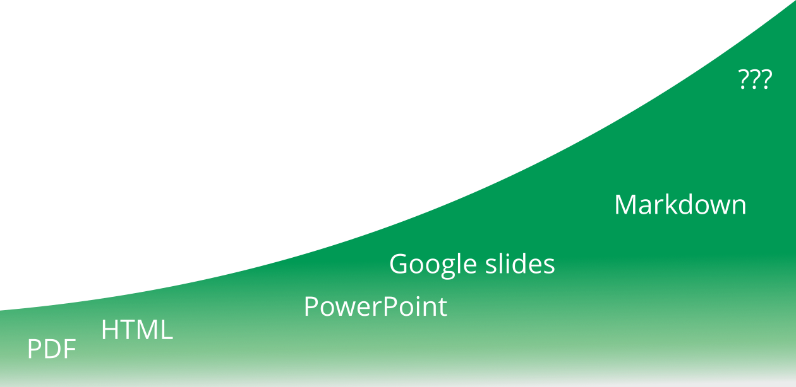

<!--
title: "Liascript Presentations"

import: https://raw.githubusercontent.com/LiaScript/CodeRunner/master/README.md
        https://raw.githubusercontent.com/LiaTemplates/BeforeAndAfter/0.0.1/README.md

icon:   https://tess.elixir-europe.org/assets/elixir/elixir-tess-219b707c4912e9c46c917a24ce72b464ec9f2fd56ce03dbcee8b2f6b9ac98a44.svg

link:   https://cdnjs.cloudflare.com/ajax/libs/animate.css/4.1.1/animate.min.css
        https://fonts.googleapis.com/css?family=Lato:400,400italic,700
        style.css

@runR: @LIA.eval(`["main.R"]`, `none`, `Rscript main.R`)

@JSONLD
<script run-once>
  let json = @0 

  const script = document.createElement('script');
  script.type = 'application/ld+json';
  script.text = JSON.stringify(json);

  document.head.appendChild(script);

  // this is only needed to prevent and output,
  // as long as the result of a script is undefined,
  // it is not shown or rendered within LiaScript
  console.debug("added json to head")
</script>
@end


link:   https://unpkg.com/leaflet@1.9.4/dist/leaflet.css
script: https://unpkg.com/leaflet@1.9.4/dist/leaflet.js

-->

# Training materials formats

This presentation will guide you through this session where we will touch on:

- different types of training materials and its re-usability
-
- Image, video, and iframe embedding
- Elegant transitions and animations
- Printing to PDF via Liascript Exporter

...and much more

```json   @JSONLD
{
  "@context": "https://schema.org/",
  "@type": "LearningResource",
  "@id": "https://elixir-europe-training.github.io/ELIXIR-TrP-TeSS/",
  "http://purl.org/dc/terms/conformsTo": {
    "@type": "CreativeWork",
    "@id": "https://bioschemas.org/profiles/TrainingMaterial/1.0-RELEASE"
  },
  "description": "TeSS, how can I help you? This is our interactive hands-on course about efficient use of the ELIXIR TeSS platform.",
  "keywords": "FAIR, OPEN, Bioinformatics, Teaching, TeSS",
  "name": "TeSS, how can I help you?",
  "license": "https://creativecommons.org/licenses/by/4.0/",
  "educationalLevel": "beginner",
  "competencyRequired": "none",
  "teaches": [
    "search events and material in TeSS via direct and faceted search",
    "add manually and automatically events and material to TeSS",
    "extract events and material from TeSS by using TeSS widgets"
  ],
  "audience": "training providers",
  "inLanguage": "en-US",
  "learningResourceType": [
    "tutorial"
  ],
  "author": [
    {
      "@type": "Person",
      "name": "Bruna Piereck"
    },
    {
      "@type": "Person",
      "name": "Olivier Sand"
    },
    {
      "@type": "Person",
      "name": "Alexander Botzki"
    }
  ],
  "contributor": [
    {
      "@type": "Person",
      "name": "Yasmine Maes"
    },
    {
      "@type": "Person",
      "name": "Finn Bacall"
    },
    {
      "@type": "Person",
      "name": "Munazah Andrabi"
    }
  ]
}
```

## Formats for training material

           --{{0}}--
Welcome, everyone! Today, we’re going to embark on an interactive journey to explore the diverse landscape of training materials in life sciences. Our activity is designed to not only identify the various formats available but also to reflect on our personal preferences and the rationale behind them. Here is the activity Overview: We’ll examine different types of training materials, ranging from slides and videos to datasets and software. For each category, we’ll determine the possible formats they could take. Then, we’ll dive deeper to discuss which formats we predominantly use and, most importantly, why we prefer those over others. This exercise will not only enhance our understanding of the material formats but also provide insights into our teaching methodologies. It’s a chance to share experiences, learn from each other, and possibly discover new ways to engage our audience.
So, let’s get started! Please go to to the joint file. As we proceed, I encourage you to think critically about the ‘why’—it’s the key to understanding our choices and improving our approach to training. Let’s have a productive session!

              {{0-1}}
|  <!-- style = "width: 80px; padding:15px;"-->    |      Activity: How many training materials formats can you list? Identify possible formats for each type of material. Which format(s) do you mostly adopt? Why?   |

              {{1}}
*************

| Material type | Possible format(s) | Format(s) you mostly use | Why? |
| ----------------- | ------------------ | ------------------------ | ---- |
| slides |                |                          |      |
| video |                    |                          |      |
| dataset  |                    |                          |      |
| repository |  |    |      |
| exercises  |                    |                          |      |
| VM/Container |                    |                          |      |
| tutorial/hands-on |      |                          |      |
| software |                    |                          |      |
| webpage |                    |                          |      |

***********

## Compare your discussion results 

               --{{0}}--
Let's take a moment to reflect on our recent discussions and how they align with the insights from the "10 simple rules" paper. Our conversation has highlighted the various formats we use to disseminate knowledge in life sciences, each with its own set of advantages and challenges.
**PowerPoint (PPT and PPTX)**
- **Advantages:** These formats are easily (re)usable, widely available across different operating systems and software, and have widespread recognition.
- **Disadvantages:** They provide a limited scope for delivering detailed training instructions and lack version control.
**Keynote**
- **Advantages:** Offers a polished overall aesthetic that can enhance the presentation quality.
- **Disadvantages:** Its usage is confined to the macOS family, and it does not support version control.
**PDF**
- **Advantages:** PDFs ensure consistent display across various environments, maintaining the integrity of the content.
- **Disadvantages:** They are not easily editable, which can be a hindrance when updates are needed, and they also lack version control.
**TeX**
- **Advantages:** TeX is easily editable and supports version control, making it a robust choice for collaborative work.
- **Disadvantages:** However, it comes with a steep learning curve that can be a barrier for some trainers.
**Markdown (MD), reStructuredText (RST), and HTML**
- **Advantages:** These formats are version controlled and free, promoting accessibility and ease of updates.
- **Disadvantages:** They require rendering, which may necessitate additional steps to convert into a visually appealing HTML format.
**Google Slides**
- **Advantages:** Google Slides are version controlled and freely available, supporting collaborative efforts.
- **Disadvantages:** Their usage can be restricted by local or institutional policies, and accessibility issues may arise depending on the user's geographic location.
As we continue with our training, let's consider how these formats serve our objectives and the ways in which we can leverage their strengths while mitigating their limitations. Thank you for your thoughtful contributions to this discussion. Now, let's proceed with our next topic.

Compare the list to Table 1 from the '10 simple rules' paper[^1].

| Format            | Advantages                                       | Disadvantages                                   |
|-------------------|--------------------------------------------------|-------------------------------------------------|
| **PPT and PPTX**      | Easily (re)usable                              | Limited way to provide detailed training  instructions    |
|                   | Available to multiple OSs/Software             |                                     |
|                   | Widespread                                     | Not version controlled                        |
| **Keynote**           | Polished overall aesthetic                     | Limited to macOS family                       |
|                   |                                                  | Not version controlled                        |
| **PDF**               | Can be displayed identically in any environment| Not easily editable                           |
|                   |                                                  | Not version controlled                        |
| **TeX**               | Easily editable                                | Steep learning curve for trainers             |
|                   | Version controlled                             |                                                 |
| **MD,RST and HTML** | Version controlled                             | Rendering (need templating to transform into HTML) |
|                   | Free                                           |                                            |
| **Google slides**    | Version controlled                              | Not always possible to use owing to local/institutional policies     |
|                   |    Free                                           |     Not always accessible (depending on geographic location                     |

[^1]: https://journals.plos.org/ploscompbiol/article/figure?id=10.1371/journal.pcbi.1007854.t001


## Summary of training material file formats

               --{{0}}--
Now, we're going to consolidate our understanding of the diverse resources we've been discussing. These resources form the backbone of our life science training and are crucial for a holistic learning experience. Let's take a brief tour through these resources: **Presentations:** Our journey begins with presentations, the visual storytellers of complex concepts. They are the bar charts of our training, providing clear, structured information at a glance. **Website:** The globe of our resources, the website is your go-to destination for a wealth of knowledge, accessible anytime and anywhere, enriching your learning beyond the classroom. **Video:** Like the play button that brings static images to life, our videos offer dynamic and engaging narratives, making complex topics digestible and memorable. **Guidelines:** The checklists of our training, these guidelines are your roadmap to best practices and essential procedures, ensuring you're always on the right track. **Dataset:** Represented by database cylinders, our datasets are the real-world data playgrounds where you can apply and hone your analytical skills. **Tutorial:** The overlapping squares symbolize our tutorials, which provide step-by-step guidance, helping you navigate through practical applications with ease. **Software:** The gear of our toolkit, software training is where you'll gain hands-on experience with the tools that drive life science research forward. Each of these resources is interconnected, creating a comprehensive network that supports your journey in the life sciences. As we move forward, remember that each resource is a piece of a larger puzzle, and together, they form a complete picture of the knowledge and skills you need to succeed.
Now, let's continue to build on this foundation and delve deeper into our next activity. Thank you for your engagement and enthusiasm!

<!-- style="position: absolute; top: 150px; left: 80px; width: 450px;" -->

[^1]: https://docs.google.com/presentation/d/1fVbtwJACMnRM8GgMpGVfi373geFMQCZH6uSoihsRyxM/edit#slide=id.g26da19ef7b0_0_789

## Crafted for Collaboration - your training materials enhanced with Interoperable Materials

               --{{0}}--
Training materials need to be captured in interoperable formats, so that they can be used in different contexts (e.g., operating systems and software) and built upon later. For materials like slides, it is important that other trainers are able to (re)use, fine-tune or even extend them. This means that you should choose a format that supports editing and extension.

TODO: illustration (svg with icons) based on the following items
Interoperability: Ensure your training materials are versatile. Use formats that are compatible across various operating systems and software platforms.
Reusability: Design your slides for longevity. Allow other trainers to adopt and adapt your materials with ease.
Editability & Extensibility: Select formats that support seamless editing and extension, enabling continuous improvement and customization.

Rule 6 from the 10 simple rules paper is mainly about interoperability [10 simple rules paper](https://journals.plos.org/ploscompbiol/article?id=10.1371/journal.pcbi.1007854#sec007).

## Discuss about the interoperabilty of training material

| <!-- style = "width: 80px; padding:15px;"-->  | Activity: Have a look at the slides on the [String Database (by Lars Juhl Jensen)](https://www.slideshare.net/larsjuhljensen/the-string-database) on Slideshare. Imagine the slides were downloadable in pptx format.   |

1. Could the presentation be extended?
2. Could you choose a few slides and incorporate them in your presentation?
3. Could you easily fix a typo?

## Discuss interoperability and re-usability of training material

| <!-- style = "width: 80px; padding:15px;"-->   | Activity: Consider the list of in table 1. For each format, specify whether it is interoperable, reusable or both and explain the reason for your opinion.   |
     
| Formats | Interoperability | Reusability |
| :---: | :---: | :---: |
| pdf | partially | yes | 
| | *A pdf can be read in any OS, but to modify it you need to pay a licence* | *Only as is* | 
| ... | yes/no/partially | yes/no/partially | 
| | *Explanation* | *Explanation* | 

## The more context you give about your material the better

          --{{0}}--
1. For a lecture-style presentation, you can annotate each slide with an extensive narrative capturing all aspects of the subject on the slides. You can put the complete transcript of the verbal presentation in the Notes panel in Powerpoint or in Google slides. Suppose you want to share your slides in pdf format. In that case, it is handier to place the detailed content into a handbook or use text-book style reference materials and keep the slides for lectures cleaner, only placing relevant elements directly on the slides. 
2. You may associate “Instructor notes” with the materials, but you don’t need to include them in the materials. The Instructor notes should provide information drawing on your experience or the experience of other instructors. They may consist of technical tips and tricks, common problems, and a description of what parts or exercises are essential and what could be skipped in case of lack of time. Very good examples of Instructor/Trainer notes are provided by the Carpentries ([Carpentry Trainer notes](https://carpentries.github.io/instructor-training/guide/index.html#curriculum), [Instructor notes template](https://carpentries.github.io/lesson-example/guide/index.html)).
3. You may create a lesson plan describing the purpose and the mode of delivery of each piece of material. Lesson plans could contain many practical details, including - for each part of the material - the time needed for the delivery, the learning experiences and expected learning outcomes. Chapter 2.4 shows an example Lesson plan of this lesson.

|   |      |      |
| :---------: | :---------: | :---------: |
| <!--
style = "width: 200px;"
-->   |  <!--
style = "width: 200px;"
--> | <!--
style = "width: 200px;"
--> |
| narratives  | instructor notes     | lesson plan     |

## Create and discuss Interoperable and Reproducible training material (text, presentation)

Let's first have a look at example presentations.

Example presentation:
Github: https://github.com/vibbits/material-liascript/blob/master/example-presentation.md?plain=1
Rendering: 
https://liascript.github.io/course/?https://raw.githubusercontent.com/vibbits/material-liascript/master/example-presentation.md#1

TODO: create slides with guide the practical exercises

Exercises

| <!--
style = "width: 100px;"
-->   | Activity: Create a presentation using a markdown dialect called Liascript  |

TODO: AI element about Liascript

To use MarkDown tools to create material (text and presentation)
- LiaScript
  LiaScript
Doc about Liascript
https://liascript.github.io/course/?https://raw.githubusercontent.com/liaScript/docs/master/README.md#1


| <!--
style = "width: 100px;"
-->   | Activity: Create a PDF or   |


## Final considerations

<!-- style="position: absolute; top: 150px; left: 80px; width: 450px;" -->
